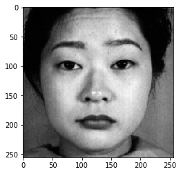
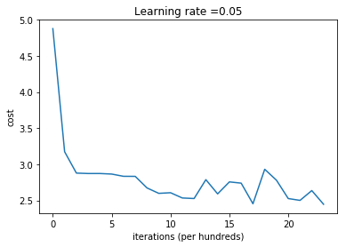
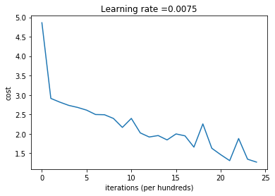
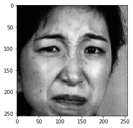
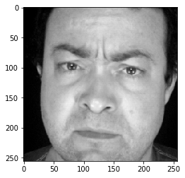

### This is a fun project I worked on after completing the first course of the deeplearning specialization on coursera by deeplearning.ai. This is not an accurate model, I did a quick rough implementation of the binary classification model that I created for an assignment in the course. 


```python
import time
import numpy as np
import h5py
import matplotlib.pyplot as plt
import scipy
from PIL import Image
from scipy import ndimage
from dnn_app_utils_v3 import *
import os
import cv2
from sklearn.model_selection import train_test_split

%matplotlib inline
plt.rcParams['figure.figsize'] = (5.0, 4.0) # set default size of plots
plt.rcParams['image.interpolation'] = 'nearest'
plt.rcParams['image.cmap'] = 'gray'

%load_ext autoreload
%autoreload 2

np.random.seed(1)
```

Get the list of image files located in the folder 'faces'


```python
images = os.listdir("./faces")

if 'desktop.ini' in images:
    images.remove('desktop.ini')
```

# This is a function to only use the files with classes : anger, fear, disgust, happy, sad, surprised, and neutral. The pictures are from VISGRAF faces Database and Japanese Female Facial Expression (JAFFE) Database. 


```python
def contains_keyword(file):
    keywords = ['AN', 'DI', 'FE', 'HA', 'SA', 'SU', 'NE', '-00','-01','-02','-03','-04','-05','-06'] 
    b_list = [i in files for i in keywords]
    if True in b_list:
        return True
    else:
        return False
```

## Getting labels and pre-processing images


```python
labels = []
emotions = []
X = []

# anger = 1; disgust = 2; fear = 3; happy = 4; sad = 5; surprised = 6; neutral = 0

for files in images:
    if contains_keyword(files):
        fname = "faces/" + files
        img = cv2.imread(fname)
        img = cv2.cvtColor(img, cv2.COLOR_BGR2GRAY)
        #my_image = cv2.resize(img, (num_px, num_px)) 
        my_image = img/255.
        X.append(my_image)
        
    label_each = np.zeros(7)
    if 'AN' in files:
        emotions.append('Angry')
        label_each[0] = 1
        labels.append(label_each)
    elif 'DI' in files:
        emotions.append('Disgust')
        label_each[1] = 1
        labels.append(label_each)
    elif 'FE' in files:
        emotions.append('Fear')
        label_each[2] = 1
        labels.append(label_each)
    elif 'HA' in files:
        emotions.append('Happy')
        label_each[3] = 1
        labels.append(label_each)
    elif 'SA' in files:
        emotions.append('Sad')
        label_each[4] = 1
        labels.append(label_each)
    elif 'SU' in files:
        emotions.append('Surprised')
        label_each[5] = 1
        labels.append(label_each)    
    elif 'NE' in files:
        emotions.append('Nuetral')
        label_each[6] = 1
        labels.append(label_each)
    elif '-04' in files:
        emotions.append('Angry')
        label_each[0] = 1
        labels.append(label_each)
    elif '-05' in files:
        emotions.append('Disgust')
        label_each[1] = 1
        labels.append(label_each)
    elif '-06' in files:
        emotions.append('Fear')
        label_each[2] = 1
        labels.append(label_each)
    elif '-01' in files:
        emotions.append('Happy')
        label_each[3] = 1
        labels.append(label_each)
    elif '-02' in files:
        emotions.append('Sad')
        label_each[4] = 1
        labels.append(label_each)
    elif '-03' in files:
        emotions.append('Surprised')
        label_each[5] = 1
        labels.append(label_each)    
    elif '-00' in files:
        emotions.append('Nuetral')
        label_each[6] = 1
        labels.append(label_each)
```


```python
# total data size
m = len(labels)

Y = np.array(labels)

Y = Y.T

num_px = 256

```


```python
Y.shape
```


    (7, 453)


```python
X = np.array(X)
X.shape
```


    (453, 256, 256)


```python
X_flatten = X.reshape(X.shape[0], -1).T 
```


```python
X_flatten.shape
```


    (65536, 453)


## Split into train, test


```python
X_train, X_test, Y_train, Y_test = train_test_split(X_flatten.T, Y.T, test_size=0.33, random_state=42)
```


```python
# anger = 1; disgust = 2; fear = 3; happy = 4; sad = 5; surprised = 6; neutral = 0
def decode_exp(Y):
    switch = {
        0: "Angry",
        1: "Disgust",
        2: "Fear",
        3: "Happy",
        4: "Sad",
        5: "Surprised",
        6: "Neutral"
    }
    return switch.get(np.where(Y == 1)[0][0])         
```

The following code will show you an image in the dataset. Feel free to change the index and re-run the cell multiple times to see other images. 


```python
# Example of a picture
index = np.random.randint(0, m)
plt.imshow(X[index])
print ("y = " + str(Y.T[index]) + ". It's a(n) "  + decode_exp(Y.T[index]) + " picture.")
```

    y = [0. 0. 0. 0. 0. 0. 1.]. It's a(n) Neutral picture.
    





```python
# Explore your dataset 
m_train = X_train.shape[0]
num_px = X_train.shape[1]
m_test = X_test.shape[0]

print ("Number of training examples: " + str(m_train))
print ("Number of testing examples: " + str(m_test))
print ("Each image is of size: (" + str(num_px) + ", " + str(num_px))
print ("train_x_orig shape: " + str(X_train.shape))
print ("train_y shape: " + str(Y_train.shape))
print ("test_x_orig shape: " + str(X_test.shape))
print ("test_y shape: " + str(Y_test.shape))
```

    Number of training examples: 303
    Number of testing examples: 150
    Each image is of size: (65536, 65536
    train_x_orig shape: (303, 65536)
    train_y shape: (303, 7)
    test_x_orig shape: (150, 65536)
    test_y shape: (150, 7)
    


```python
# Reshape the training and test examples 
X_train = X_train.T
X_test = X_test.T
Y_train = Y_train.T
Y_test = Y_test.T
print ("X_train's shape: " + str(X_train.shape))
print ("X_test's shape: " + str(X_test.shape))

```

    X_train's shape: (65536, 303)
    X_test's shape: (65536, 150)
    


```python
### CONSTANTS DEFINING THE MODEL ####
n_x = 65536     # num_px * num_px
n_h = 21
n_y = 7
layers_dims = (n_x, n_h, n_y)
```


```python
#  two_layer_model

def two_layer_model(X, Y, layers_dims, learning_rate = 0.05, num_iterations = 3000, print_cost=False):
    """
    Implements a two-layer neural network: LINEAR->RELU->LINEAR->SIGMOID.
    
    Arguments:
    X -- input data, of shape (n_x, number of examples)
    Y -- true "label" vector (containing 1 if cat, 0 if non-cat), of shape (1, number of examples)
    layers_dims -- dimensions of the layers (n_x, n_h, n_y)
    num_iterations -- number of iterations of the optimization loop
    learning_rate -- learning rate of the gradient descent update rule
    print_cost -- If set to True, this will print the cost every 100 iterations 
    
    Returns:
    parameters -- a dictionary containing W1, W2, b1, and b2
    """
    
    np.random.seed(1)
    grads = {}
    costs = []                              # to keep track of the cost
    m = X.shape[1]                           # number of examples
    (n_x, n_h, n_y) = layers_dims
    
    # Initialize parameters dictionary, by calling one of the functions you'd previously implemented
    ### START CODE HERE ### (≈ 1 line of code)
    parameters = initialize_parameters(n_x, n_h, n_y)
    ### END CODE HERE ###
    
    # Get W1, b1, W2 and b2 from the dictionary parameters.
    W1 = parameters["W1"]
    b1 = parameters["b1"]
    W2 = parameters["W2"]
    b2 = parameters["b2"]
    
    # Loop (gradient descent)

    for i in range(0, num_iterations):

        # Forward propagation: LINEAR -> RELU -> LINEAR -> SIGMOID. Inputs: "X, W1, b1, W2, b2". Output: "A1, cache1, A2, cache2".
        ### START CODE HERE ### (≈ 2 lines of code)
        A1, cache1 = linear_activation_forward(X, W1, b1, "relu")
        A2, cache2 = linear_activation_forward(A1, W2, b2, "sigmoid")
        ### END CODE HERE ###
        
        # Compute cost
        ### START CODE HERE ### (≈ 1 line of code)
        cost = compute_cost(A2, Y)
        ### END CODE HERE ###
        
        # Initializing backward propagation
        dA2 = - (np.divide(Y, A2) - np.divide(1 - Y, 1 - A2))
        
        # Backward propagation. Inputs: "dA2, cache2, cache1". Outputs: "dA1, dW2, db2; also dA0 (not used), dW1, db1".
        ### START CODE HERE ### (≈ 2 lines of code)
        dA1, dW2, db2 = linear_activation_backward(dA2, cache2, "sigmoid")
        dA0, dW1, db1 = linear_activation_backward(dA1, cache1, "relu")
        ### END CODE HERE ###
        
        # Set grads['dWl'] to dW1, grads['db1'] to db1, grads['dW2'] to dW2, grads['db2'] to db2
        grads['dW1'] = dW1
        grads['db1'] = db1
        grads['dW2'] = dW2
        grads['db2'] = db2
        
        # Update parameters.
        ### START CODE HERE ### (approx. 1 line of code)
        parameters = update_parameters(parameters, grads, learning_rate)
        ### END CODE HERE ###

        # Retrieve W1, b1, W2, b2 from parameters
        W1 = parameters["W1"]
        b1 = parameters["b1"]
        W2 = parameters["W2"]
        b2 = parameters["b2"]
        
        # Print the cost every 100 training example
        if print_cost and i % 100 == 0:
            print("Cost after iteration {}: {}".format(i, np.squeeze(cost)))
        if print_cost and i % 100 == 0:
            costs.append(cost)
       
    # plot the cost

    plt.plot(np.squeeze(costs))
    plt.ylabel('cost')
    plt.xlabel('iterations (per hundreds)')
    plt.title("Learning rate =" + str(learning_rate))
    plt.show()
    
    return parameters
```

Run the cell below to train your parameters. See if your model runs. The cost should be decreasing. It may take up to 5 minutes to run 2500 iterations. Check if the "Cost after iteration 0" matches the expected output below, if not click on the square (⬛) on the upper bar of the notebook to stop the cell and try to find your error.


```python
parameters = two_layer_model(X_train, Y_train, layers_dims = (n_x, n_h, n_y), num_iterations = 2400, print_cost=True)
```

    Cost after iteration 0: 4.875995680768246
    Cost after iteration 100: 3.1738684657998206
    Cost after iteration 200: 2.8784829867549435
    Cost after iteration 300: 2.872454798583633
    Cost after iteration 400: 2.8725929437389275
    Cost after iteration 500: 2.864975492348518
    Cost after iteration 600: 2.833916040926128
    Cost after iteration 700: 2.832999988240951
    Cost after iteration 800: 2.6731968839025138
    Cost after iteration 900: 2.5981275789259666
    Cost after iteration 1000: 2.6068779921337994
    Cost after iteration 1100: 2.5342387259612225
    Cost after iteration 1200: 2.5265967945223116
    Cost after iteration 1300: 2.7875896271793525
    Cost after iteration 1400: 2.590992085706562
    Cost after iteration 1500: 2.756637138000294
    Cost after iteration 1600: 2.739351555752944
    Cost after iteration 1700: 2.454424567071349
    Cost after iteration 1800: 2.9310907701659015
    Cost after iteration 1900: 2.779588208873214
    Cost after iteration 2000: 2.5262994669170427
    Cost after iteration 2100: 2.501026967598572
    Cost after iteration 2200: 2.6366004065687036
    Cost after iteration 2300: 2.447086383132006
    





**Expected Output**:
<table> 
    <tr>
        <td> **Cost after iteration 0**</td>
        <td> 0.6930497356599888 </td>
    </tr>
    <tr>
        <td> **Cost after iteration 100**</td>
        <td> 0.6464320953428849 </td>
    </tr>
    <tr>
        <td> **...**</td>
        <td> ... </td>
    </tr>
    <tr>
        <td> **Cost after iteration 2400**</td>
        <td> 0.048554785628770226 </td>
    </tr>
</table>

Good thing you built a vectorized implementation! Otherwise it might have taken 10 times longer to train this.

Now, you can use the trained parameters to classify images from the dataset. To see your predictions on the training and test sets, run the cell below.


```python
predictions_train = predict(X_train, Y_train, parameters)
```

    Accuracy: 0.40594059405940597
    


```python
predictions_test = predict(X_test, Y_test, parameters)
```

    Accuracy: 0.29333333333333333
    


```python
### CONSTANTS ###
layers_dims = [65536 , 28, 21, 14, 7] #  4-layer model
```


```python
#  FUNCTION: L_layer_model
def L_layer_model(X, Y, layers_dims, learning_rate = 0.0075, num_iterations = 3000, print_cost=False):#lr was 0.009
    """
    Implements a L-layer neural network: [LINEAR->RELU]*(L-1)->LINEAR->SIGMOID.
    
    Arguments:
    X -- data, numpy array of shape (num_px * num_px * 3, number of examples)
    Y -- true "label" vector (containing 0 if cat, 1 if non-cat), of shape (1, number of examples)
    layers_dims -- list containing the input size and each layer size, of length (number of layers + 1).
    learning_rate -- learning rate of the gradient descent update rule
    num_iterations -- number of iterations of the optimization loop
    print_cost -- if True, it prints the cost every 100 steps
    
    Returns:
    parameters -- parameters learnt by the model. They can then be used to predict.
    """

    np.random.seed(1)
    costs = []                         # keep track of cost
    
    # Parameters initialization. (≈ 1 line of code)
    ### START CODE HERE ###
    parameters = initialize_parameters_deep(layers_dims)
    ### END CODE HERE ###
    
    # Loop (gradient descent)
    for i in range(0, num_iterations):

        # Forward propagation: [LINEAR -> RELU]*(L-1) -> LINEAR -> SIGMOID.
        ### START CODE HERE ### (≈ 1 line of code)
        AL, caches = L_model_forward(X, parameters)
        ### END CODE HERE ###
        
        # Compute cost.
        ### START CODE HERE ### (≈ 1 line of code)
        cost = compute_cost(AL, Y)
        ### END CODE HERE ###
    
        # Backward propagation.
        ### START CODE HERE ### (≈ 1 line of code)
        grads = L_model_backward(AL, Y, caches)
        ### END CODE HERE ###
 
        # Update parameters.
        ### START CODE HERE ### (≈ 1 line of code)
        parameters = update_parameters(parameters, grads, learning_rate)
        ### END CODE HERE ###
                
        # Print the cost every 100 training example
        if print_cost and i % 100 == 0:
            print ("Cost after iteration %i: %f" %(i, cost))
        if print_cost and i % 100 == 0:
            costs.append(cost)
            
    # plot the cost
    plt.plot(np.squeeze(costs))
    plt.ylabel('cost')
    plt.xlabel('iterations (per hundreds)')
    plt.title("Learning rate =" + str(learning_rate))
    plt.show()
    
    return parameters
```

You will now train the model as a 4-layer neural network. 

Run the cell below to train your model. The cost should decrease on every iteration. It may take up to 5 minutes to run 2500 iterations. Check if the "Cost after iteration 0" matches the expected output below, if not click on the square (⬛) on the upper bar of the notebook to stop the cell and try to find your error.


```python
parameters = L_layer_model(X_train, Y_train, layers_dims, num_iterations = 2400, print_cost = True)
```

    Cost after iteration 0: 4.861358
    Cost after iteration 100: 2.910636
    Cost after iteration 200: 2.815051
    Cost after iteration 300: 2.731079
    Cost after iteration 400: 2.677853
    Cost after iteration 500: 2.608153
    Cost after iteration 600: 2.495593
    Cost after iteration 700: 2.489661
    Cost after iteration 800: 2.394400
    Cost after iteration 900: 2.163300
    Cost after iteration 1000: 2.395327
    Cost after iteration 1100: 2.021839
    Cost after iteration 1200: 1.915810
    Cost after iteration 1300: 1.953375
    Cost after iteration 1400: 1.840486
    Cost after iteration 1500: 1.994984
    Cost after iteration 1600: 1.946118
    Cost after iteration 1700: 1.654807
    Cost after iteration 1800: 2.253485
    Cost after iteration 1900: 1.625593
    Cost after iteration 2000: 1.459679
    Cost after iteration 2100: 1.306641
    Cost after iteration 2200: 1.876535
    Cost after iteration 2300: 1.343405
    Cost after iteration 2400: 1.268887
    





**Expected Output**:
<table> 
    <tr>
        <td> **Cost after iteration 0**</td>
        <td> 0.771749 </td>
    </tr>
    <tr>
        <td> **Cost after iteration 100**</td>
        <td> 0.672053 </td>
    </tr>
    <tr>
        <td> **...**</td>
        <td> ... </td>
    </tr>
    <tr>
        <td> **Cost after iteration 2400**</td>
        <td> 0.092878 </td>
    </tr>
</table>


```python
pred_train = predict(X_train, Y_train, parameters)
```

    Accuracy: 0.504950495049505
    


```python
pred_test = predict(X_test, Y_test, parameters)
```

    Accuracy: 0.4
    


```python
def decode_predict(y):
    switch = {
        0: "Angry",
        1: "Disgust",
        2: "Fear",
        3: "Happy",
        4: "Sad",
        5: "Surprised",
        6: "Neutral"
    }
    return switch.get(y[0])
```

## Randomly checking the predictions


```python
## START CODE HERE ##
index = np.random.randint(0, X_test.shape[1])
my_image = X_test.T[index].reshape(256*256,1)
my_label_y = Y_test.T[index].reshape((7,1)) # the true class of your image (1 -> cat, 0 -> non-cat)
## END CODE HERE ##

my_predicted_image = predict(my_image, my_label_y, parameters)
print("Actual: " + decode_exp(Y_test.T[index]) + ' face')
print("Predicted: " + decode_predict(my_predicted_image) + ' face')
plt.imshow(X_test.T[index].reshape(256,256))
#print ("y = " + str(np.squeeze(my_predicted_image)) + ", your L-layer model predicts a \"" + classes[int(np.squeeze(my_predicted_image)),].decode("utf-8") +  "\" picture.")
```

    Accuracy: 1.0
    Actual: Disgust face
    Predicted: Disgust face
    


    <matplotlib.image.AxesImage at 0x1fe07bd29b0>





## It correctly predicts certain type of faces, but gets confused with similar expressions: sad, disgust, angry. 

## Below we can see how the expression lies on the boundary between sad/disgust


```python
## START CODE HERE ##
index = np.random.randint(0, X_test.shape[1])
my_image = X_test.T[index].reshape(256*256,1)
my_label_y = Y_test.T[index].reshape((7,1)) # the true class of your image (1 -> cat, 0 -> non-cat)
## END CODE HERE ##

my_predicted_image = predict(my_image, my_label_y, parameters)
print("Actual: " + decode_exp(Y_test.T[index]) + ' face')
print("Predicted: " + decode_predict(my_predicted_image) + ' face')
plt.imshow(X_test.T[index].reshape(256,256))
#print ("y = " + str(np.squeeze(my_predicted_image)) + ", your L-layer model predicts a \"" + classes[int(np.squeeze(my_predicted_image)),].decode("utf-8") +  "\" picture.")
```

    Accuracy: 0.0
    Actual: Sad face
    Predicted: Disgust face
    


    <matplotlib.image.AxesImage at 0x1fe07f41eb8>




