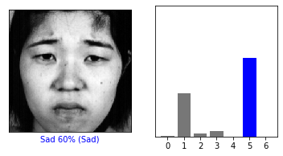

### This is a fun project I worked on after completing the first course of the deeplearning specialization on coursera by deeplearning.ai. This is not an accurate model, I did a quick rough implementation of the binary classification model that I created for an assignment in the course. 


### *** LETS DO IT NOW USING tensorflow ***


```python
# TensorFlow and tf.keras
import tensorflow as tf
from tensorflow import keras

# Helper libraries
import numpy as np
import matplotlib.pyplot as plt
from google.colab import drive
import cv2
from sklearn.model_selection import train_test_split
plt.rcParams['figure.figsize'] = (5.0, 4.0) # set default size of plots
plt.rcParams['image.interpolation'] = 'nearest'
plt.rcParams['image.cmap'] = 'gray'
import os
```


```python
drive.mount('/content/gdrive/')
```

    Drive already mounted at /content/gdrive/; to attempt to forcibly remount, call drive.mount("/content/gdrive/", force_remount=True).
    

Get the list of image files located in the folder 'faces'


```python
images = os.listdir('gdrive/My Drive/Colab Notebooks/faces')

```

# This is a function to only use the files with classes : anger, fear, disgust, happy, sad, surprised, and neutral. The pictures are from VISGRAF faces Database and Japanese Female Facial Expression (JAFFE) Database. 


```python
def contains_keyword(file):
    keywords = ['AN', 'DI', 'FE', 'HA', 'SA', 'SU', 'NE', '-00','-01','-02','-03','-04','-05','-06'] 
    b_list = [i in files for i in keywords]
    if True in b_list:
        return True
    else:
        return False
```

## Getting labels and pre-processing images


```python
labels = []
emotions = []
X = []
num_px = 256

# neutral = 0; anger = 1; disgust = 2; fear = 3; happy = 4; sad = 5; surprised = 6;

for files in images:
    if contains_keyword(files):
        fname = "gdrive/My Drive/Colab Notebooks/faces/" + files
        img = cv2.imread(fname)
        img = cv2.cvtColor(img, cv2.COLOR_BGR2GRAY)
        my_image = cv2.resize(img, (num_px, num_px)) 
        my_image = img/255.
        X.append(my_image)

    if 'AN' in files or '-04' in files:
        emotions.append('Angry')
        labels.append(1)
    elif 'DI' in files or '-05' in files:
        emotions.append('Disgust')
        labels.append(2)
    elif 'FE' in files or '-06' in files:
        emotions.append('Fear')
        labels.append(3)
    elif 'HA' in files or '-01' in files:
        emotions.append('Happy')
        labels.append(4)
    elif 'SA' in files or '-02' in files:
        emotions.append('Sad')
        labels.append(5)
    elif 'SU' in files or '-03' in files:
        emotions.append('Surprised')
        labels.append(6)    
    elif 'NE' in files or '-00' in files:
        emotions.append('Nuetral')
        labels.append(0)
```


```python
class_names = ['Neutral', 'Anger', 'Disgust', 'Fear', 'Happy',
               'Sad', 'Surprised']
```


```python
# total data size
m = len(labels)

Y = np.array(labels)
X = np.array(X)


```


```python
X.shape
```


    (453, 256, 256)


```python

X_flatten = X.reshape(X.shape[0], -1)
```


```python
len(Y)
```


    453


```python
plt.figure()
plt.imshow(X[0])
plt.colorbar()
plt.grid(False)
plt.show()
```


```python
plt.figure(figsize=(10,10))
for i in range(25):
    plt.subplot(5,5,i+1)
    plt.xticks([])
    plt.yticks([])
    plt.grid(False)
    plt.imshow(X[i])
    plt.xlabel(class_names[Y[i]])
plt.show()
```


## Split into train, test


```python
X_flatten[0].shape
```


    (65536,)


```python
X_train, X_test, Y_train, Y_test = train_test_split(X_flatten, Y, test_size=0.20, random_state=42)
```


```python
X_train.shape
```


    (362, 65536)


```python
Y_train
```


    array([1, 5, 0, 3, 6, 1, 6, 0, 6, 1, 6, 2, 5, 0, 0, 3, 6, 5, 6, 1, 5, 0,
           3, 1, 2, 3, 1, 5, 0, 6, 0, 4, 5, 5, 4, 5, 4, 6, 0, 0, 1, 0, 1, 3,
           3, 2, 5, 1, 3, 0, 4, 3, 5, 0, 5, 6, 2, 1, 2, 0, 6, 6, 4, 4, 0, 3,
           4, 0, 2, 3, 4, 1, 2, 0, 1, 3, 6, 5, 5, 1, 3, 3, 0, 6, 4, 6, 3, 3,
           2, 3, 3, 2, 1, 0, 6, 3, 2, 3, 4, 0, 4, 0, 1, 3, 6, 4, 5, 3, 4, 1,
           4, 5, 0, 5, 0, 4, 5, 4, 4, 0, 2, 6, 0, 3, 0, 4, 3, 1, 0, 4, 0, 4,
           5, 1, 4, 6, 3, 4, 1, 1, 2, 0, 5, 0, 6, 0, 3, 2, 1, 6, 6, 1, 3, 6,
           5, 5, 2, 1, 2, 5, 6, 1, 0, 4, 6, 6, 4, 6, 1, 1, 2, 2, 2, 5, 4, 1,
           6, 2, 2, 1, 1, 0, 4, 3, 5, 6, 0, 6, 5, 1, 2, 1, 5, 6, 6, 4, 6, 4,
           0, 4, 6, 4, 0, 4, 0, 4, 5, 6, 1, 6, 1, 6, 3, 5, 4, 1, 6, 3, 2, 1,
           3, 2, 6, 2, 3, 5, 1, 3, 4, 6, 3, 5, 0, 4, 2, 6, 3, 3, 5, 5, 6, 1,
           4, 2, 1, 0, 3, 1, 4, 6, 1, 5, 3, 0, 2, 4, 4, 6, 6, 2, 3, 2, 2, 1,
           1, 4, 2, 4, 2, 3, 1, 6, 0, 1, 4, 6, 3, 5, 3, 0, 6, 5, 2, 1, 2, 4,
           6, 4, 5, 5, 4, 4, 1, 2, 2, 3, 5, 2, 4, 2, 5, 3, 3, 5, 6, 0, 0, 0,
           6, 1, 1, 0, 2, 3, 3, 2, 5, 2, 6, 0, 5, 2, 4, 1, 0, 1, 6, 1, 2, 6,
           4, 5, 4, 2, 1, 3, 2, 3, 6, 4, 1, 5, 5, 0, 5, 3, 3, 5, 4, 2, 0, 4,
           1, 0, 4, 2, 0, 3, 0, 3, 2, 6])


### LETS CREATE A MODEL 


```python
model = keras.Sequential([
    keras.layers.InputLayer(input_shape = (65536,)),
    keras.layers.Dense(128, activation = 'relu'),
    keras.layers.Dense(128, activation = 'relu'),
    keras.layers.Dense(128, activation = 'relu'),
    keras.layers.Dense(7, activity_regularizer=tf.keras.regularizers.l2(0.001))
])
```

### LETS COMPILE THE MODEL


```python
model.compile(optimizer='Adamax',
              loss=tf.keras.losses.SparseCategoricalCrossentropy(from_logits=True),
              metrics=['accuracy'], run_eagerly=True)
```

### FEED THE MODEL


```python
model.fit(X_train, Y_train, epochs=60)
```

    Epoch 1/60
    12/12 [==============================] - 1s 65ms/step - loss: 8.0944 - accuracy: 0.1298
    Epoch 2/60
    12/12 [==============================] - 1s 61ms/step - loss: 2.6393 - accuracy: 0.2099
    Epoch 3/60
    12/12 [==============================] - 1s 62ms/step - loss: 2.0447 - accuracy: 0.2099
    Epoch 4/60
    12/12 [==============================] - 1s 61ms/step - loss: 2.0394 - accuracy: 0.2320
    Epoch 5/60
    12/12 [==============================] - 1s 60ms/step - loss: 2.0246 - accuracy: 0.2762
    Epoch 6/60
    12/12 [==============================] - 1s 61ms/step - loss: 1.8533 - accuracy: 0.2735
    Epoch 7/60
    12/12 [==============================] - 1s 62ms/step - loss: 1.7749 - accuracy: 0.2735
    Epoch 8/60
    12/12 [==============================] - 1s 61ms/step - loss: 1.8011 - accuracy: 0.4282
    Epoch 9/60
    12/12 [==============================] - 1s 60ms/step - loss: 1.9108 - accuracy: 0.2707
    Epoch 10/60
    12/12 [==============================] - 1s 61ms/step - loss: 1.7970 - accuracy: 0.2873
    Epoch 11/60
    12/12 [==============================] - 1s 59ms/step - loss: 1.6215 - accuracy: 0.3867
    Epoch 12/60
    12/12 [==============================] - 1s 59ms/step - loss: 1.4846 - accuracy: 0.4530
    Epoch 13/60
    12/12 [==============================] - 1s 60ms/step - loss: 1.4595 - accuracy: 0.4807
    Epoch 14/60
    12/12 [==============================] - 1s 62ms/step - loss: 1.4428 - accuracy: 0.4751
    Epoch 15/60
    12/12 [==============================] - 1s 60ms/step - loss: 1.4446 - accuracy: 0.4834
    Epoch 16/60
    12/12 [==============================] - 1s 62ms/step - loss: 1.4156 - accuracy: 0.4862
    Epoch 17/60
    12/12 [==============================] - 1s 61ms/step - loss: 1.3760 - accuracy: 0.4696
    Epoch 18/60
    12/12 [==============================] - 1s 63ms/step - loss: 1.2869 - accuracy: 0.5442
    Epoch 19/60
    12/12 [==============================] - 1s 60ms/step - loss: 1.2834 - accuracy: 0.5497
    Epoch 20/60
    12/12 [==============================] - 1s 62ms/step - loss: 1.3357 - accuracy: 0.5414
    Epoch 21/60
    12/12 [==============================] - 1s 60ms/step - loss: 1.3421 - accuracy: 0.5221
    Epoch 22/60
    12/12 [==============================] - 1s 60ms/step - loss: 1.1680 - accuracy: 0.6022
    Epoch 23/60
    12/12 [==============================] - 1s 59ms/step - loss: 1.2014 - accuracy: 0.6050
    Epoch 24/60
    12/12 [==============================] - 1s 61ms/step - loss: 1.1583 - accuracy: 0.5801
    Epoch 25/60
    12/12 [==============================] - 1s 60ms/step - loss: 1.1435 - accuracy: 0.6243
    Epoch 26/60
    12/12 [==============================] - 1s 59ms/step - loss: 1.0814 - accuracy: 0.6354
    Epoch 27/60
    12/12 [==============================] - 1s 60ms/step - loss: 1.0592 - accuracy: 0.6740
    Epoch 28/60
    12/12 [==============================] - 1s 59ms/step - loss: 1.1595 - accuracy: 0.5939
    Epoch 29/60
    12/12 [==============================] - 1s 58ms/step - loss: 1.0936 - accuracy: 0.6160
    Epoch 30/60
    12/12 [==============================] - 1s 60ms/step - loss: 1.1044 - accuracy: 0.6326
    Epoch 31/60
    12/12 [==============================] - 1s 59ms/step - loss: 1.0102 - accuracy: 0.6685
    Epoch 32/60
    12/12 [==============================] - 1s 58ms/step - loss: 0.9517 - accuracy: 0.7127
    Epoch 33/60
    12/12 [==============================] - 1s 59ms/step - loss: 0.9634 - accuracy: 0.7210
    Epoch 34/60
    12/12 [==============================] - 1s 59ms/step - loss: 0.9353 - accuracy: 0.7182
    Epoch 35/60
    12/12 [==============================] - 1s 59ms/step - loss: 0.9467 - accuracy: 0.7265
    Epoch 36/60
    12/12 [==============================] - 1s 59ms/step - loss: 0.9090 - accuracy: 0.7514
    Epoch 37/60
    12/12 [==============================] - 1s 59ms/step - loss: 0.8486 - accuracy: 0.7541
    Epoch 38/60
    12/12 [==============================] - 1s 59ms/step - loss: 0.9144 - accuracy: 0.7127
    Epoch 39/60
    12/12 [==============================] - 1s 60ms/step - loss: 0.8321 - accuracy: 0.7597
    Epoch 40/60
    12/12 [==============================] - 1s 59ms/step - loss: 0.7881 - accuracy: 0.7845
    Epoch 41/60
    12/12 [==============================] - 1s 60ms/step - loss: 0.7637 - accuracy: 0.7956
    Epoch 42/60
    12/12 [==============================] - 1s 59ms/step - loss: 0.7887 - accuracy: 0.8039
    Epoch 43/60
    12/12 [==============================] - 1s 62ms/step - loss: 0.7691 - accuracy: 0.7928
    Epoch 44/60
    12/12 [==============================] - 1s 60ms/step - loss: 0.7775 - accuracy: 0.7680
    Epoch 45/60
    12/12 [==============================] - 1s 61ms/step - loss: 0.7472 - accuracy: 0.8094
    Epoch 46/60
    12/12 [==============================] - 1s 61ms/step - loss: 0.7960 - accuracy: 0.7652
    Epoch 47/60
    12/12 [==============================] - 1s 60ms/step - loss: 0.7336 - accuracy: 0.7845
    Epoch 48/60
    12/12 [==============================] - 1s 60ms/step - loss: 0.8333 - accuracy: 0.7265
    Epoch 49/60
    12/12 [==============================] - 1s 59ms/step - loss: 0.7089 - accuracy: 0.7707
    Epoch 50/60
    12/12 [==============================] - 1s 60ms/step - loss: 0.6650 - accuracy: 0.7845
    Epoch 51/60
    12/12 [==============================] - 1s 60ms/step - loss: 0.6920 - accuracy: 0.8011
    Epoch 52/60
    12/12 [==============================] - 1s 60ms/step - loss: 0.6256 - accuracy: 0.8398
    Epoch 53/60
    12/12 [==============================] - 1s 59ms/step - loss: 0.7953 - accuracy: 0.7320
    Epoch 54/60
    12/12 [==============================] - 1s 59ms/step - loss: 0.6706 - accuracy: 0.7901
    Epoch 55/60
    12/12 [==============================] - 1s 61ms/step - loss: 0.6228 - accuracy: 0.8149
    Epoch 56/60
    12/12 [==============================] - 1s 63ms/step - loss: 0.5587 - accuracy: 0.8729
    Epoch 57/60
    12/12 [==============================] - 1s 60ms/step - loss: 0.5595 - accuracy: 0.8729
    Epoch 58/60
    12/12 [==============================] - 1s 59ms/step - loss: 0.4965 - accuracy: 0.9006
    Epoch 59/60
    12/12 [==============================] - 1s 60ms/step - loss: 0.5273 - accuracy: 0.8867
    Epoch 60/60
    12/12 [==============================] - 1s 61ms/step - loss: 0.5631 - accuracy: 0.8398
    


    <tensorflow.python.keras.callbacks.History at 0x7f2891457a20>


```python
est_loss, test_acc = model.evaluate(X_test,  Y_test, verbose=2)

print('\nTest accuracy:', test_acc)
```

    3/3 - 0s - loss: 1.5569 - accuracy: 0.5275
    
    Test accuracy: 0.5274725556373596
    


```python
probability_model = tf.keras.Sequential([model, 
                                         tf.keras.layers.Softmax()])
```


```python
predictions = probability_model.predict(X_test)
```


```python
predictions[0]
```


    array([0.28819346, 0.07667705, 0.018339  , 0.04596484, 0.01074533,
           0.06403587, 0.49604434], dtype=float32)


```python
np.argmax(predictions[0])
```


    6


```python
def plot_image(i, predictions_array, true_label, img):
  predictions_array, true_label, img = predictions_array, true_label[i], img[i]
  plt.grid(False)
  plt.xticks([])
  plt.yticks([])

  plt.imshow(img, cmap='gray')

  predicted_label = np.argmax(predictions_array)
  if predicted_label == true_label:
    color = 'blue'
  else:
    color = 'red'

  plt.xlabel("{} {:2.0f}% ({})".format(class_names[predicted_label],
                                100*np.max(predictions_array),
                                class_names[true_label]),
                                color=color)

def plot_value_array(i, predictions_array, true_label):
  predictions_array, true_label = predictions_array, true_label[i]
  plt.grid(False)
  plt.xticks(range(7))
  plt.yticks([])
  thisplot = plt.bar(range(7), predictions_array, color="#777777")
  plt.ylim([0, 1])
  predicted_label = np.argmax(predictions_array)

  thisplot[predicted_label].set_color('red')
  thisplot[true_label].set_color('blue')
```

The following code will show you an image in the dataset. Feel free to change the index and re-run the cell multiple times to see other images. 


```python
X_test.reshape(91, 256,256).shape
```


    (91, 256, 256)


```python
X_test.shape
Y_test.shape
```


    (91,)


```python
i = 0
plt.figure(figsize=(6,3))
plt.subplot(1,2,1)
plot_image(i, predictions[i], Y_test, X_test.reshape(91, 256,256))
plt.subplot(1,2,2)
plot_value_array(i, predictions[i],  Y_test)
plt.show()
```


```python
i = 65
plt.figure(figsize=(6,3))
plt.subplot(1,2,1)
plot_image(i, predictions[i], Y_test, X_test.reshape(91, 256,256))
plt.subplot(1,2,2)
plot_value_array(i, predictions[i],  Y_test)
plt.show()
```





```python
num_rows = 5
num_cols = 3
num_images = num_rows*num_cols
plt.figure(figsize=(2*2*num_cols, 2*num_rows))
for i in range(num_images):
  plt.subplot(num_rows, 2*num_cols, 2*i+1)
  plot_image(i, predictions[i], Y_test, X_test.reshape(91,256,256))
  plt.subplot(num_rows, 2*num_cols, 2*i+2)
  plot_value_array(i, predictions[i], Y_test)
plt.tight_layout()
plt.show()

```


```python

```
